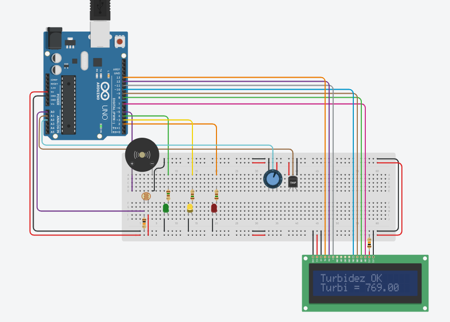

# Blue Future

Inspirado no Oceans 20, um grupo de engajamento com foco em questões como financiamento para a Economia Azul e gestão sustentável dos oceanos, o Blue Future busca por soluções inovadoras para solucionarem problemas relacionados à poluição, gestão, monitoramento de habitats marinhos, etc.

  

# Projeto

O Ocean Cleaners é uma plataforma que visa conectar equipes de limpeza e a população para ajudar a manter a limpeza dos oceanos.
Por meio de chamados abertos pela população, equipes voluntárias são direcionadas aos locais que mais necessitam de limpeza.
A implementação no Arduino consiste em um embarcado que irá monitorar a Turbidez, pH e temperatura da água, para ter certeza de que esses parâmetros não afetarão a vida marinha local.

# Tecnologias

- Arduino
- C++

# Como rodar

Faça um remix/clone do projeto no TinkerCad e clique em "Iniciar Simulação"

# Motivação

Se trata da avaliação semestral (Global Solution) para o componente Edge Computing and Computer Systems, ministrado pelo professor Lucas Demetrius.

# Membros

- Alex Maia (RM 557356)
- Marcos Ferreira (RM 556228)
- Mayla Maricato (RM 557754)

# Protótipo
O Projeto pode ser acessado [clicando aqui](https://www.tinkercad.com/things/3z5qKJTVzIx-gs-ocean-cleaners-edge-computing-and-computer-systems?sharecode=0N629VuovqcbXtP6ezPOOHDP5MhJze6yitgEZbISO94)